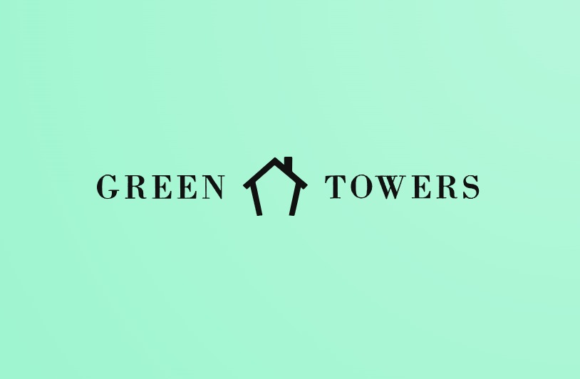

[](https://classroom.github.com/a/JZTLzScX)

# Trabalho Prático II

Integração de Sistemas de Informação

Licenciatura em Engenharia de Sistemas Informáticos (regime _pós-laboral_) 2023-24

## constituição do grupo _07_

| número | nome                             | email                 |
| :----- | :------------------------------- | :-------------------- |
| 23525  | Diogo Santos Parente             | a23525@alunos.ipca.pt |
| 21958  | Gabriel Jablonski Torres de Melo | a21958@alunos.ipca.pt |
| 21875  | Juciano Gomes Farias Junior      | a21875@alunos.ipca.pt |

## problema a resolver

título
: _Green Towers Web Api_

breve descrição
: _Este serviço dservirá uma aplicação mobile de gestão de condomínios, que foi concebida como uma solução abrangente para facilitar a gestão eficiente e a comunicação dentro de comunidades residenciais. Neste contexto, a aplicação visa simplificar processos, melhorar a transparência e a qualidade de vida dos moradores, bem como otimizar a administração de condomínios._

mais informação
:

- _O projeto foi publicado em uma VM na Azure com o seguinte endereço publico: [Azure](http://13.94.159.149/api)_
- ...

## organização do repositório

[doc/](./doc/) documentação com o relatório

[src/](./GreenTowers/) código da solução desenvolvida

# Green Towers Web API

<h2 align="center">
  
</h2>

<h4 align="center"> 
	🚧  🚀 Em produção  🚧
</h4>

<p align="center">
 <a href="#-sobre-o-projeto">Sobre</a> •
 <a href="#-layout">Layout</a> • 
 <a href="#-como-executar-o-projeto">Como executar</a> • 
 <a href="#-tecnologias">Tecnologias</a> • 
</p>

## 💻 Sobre o projeto

O projeto Green Towers surge pela necessidade de uma aplicação que centralize a comunicação, necessidades e agendamentos entre os condôminos e o administrador do condomínio

---

## 🎨 Layout

O layout da aplicação está disponível no Figma:

<a href="https://www.figma.com/file/Cx5744SNmQVbRGQlbtIanh/PDM%2FPA%2FISI?type=design&node-id=0-1&mode=design&t=qIiIiGcWoafJoabu-0">
  
</a>

---

## 🚀 Como executar o projeto

### Pré-requisitos

Antes de começar, você vai precisar ter instalado em sua máquina as seguintes ferramentas:
[Git](https://git-scm.com), [.NET SDK](https://dotnet.microsoft.com/en-us/download/visual-studio-sdks), [Docker](https://www.docker.com/).
Além disto é bom ter um editor para trabalhar com o código como [VSCode](https://code.visualstudio.com/)

🧭 Rodando a aplicação web API

```bash
# Clone este repositório
$ git clone <https://github.com/Juciano-Farias/PDM-PA-ISI.git>

# Suba o container
$ docker-compose up -d

# Aplique as migrations
$ dotnet ef database update

# Execute a build
$ dotnet build

# Execute a webapi
$ dotnet run

# O servidor inciará na porta:8000 - acesse <http://localhost:8000/>
```

# Inserção de Dados Manualmente

Insira manualmente o seguinte registro no banco de dados:

- _User Admin_:

  ```sql
  INSERT INTO public."Users"
  ("Id", "Name", "Email", "Password", "Birth", "Role", "Floor")
  VALUES (0, 'Carlos Bonzão', 'carlosbonzao@gmail.com', '$2a$12$huBu/G6M8Yoqif70D8ZUxuMU4g6/SeZAOoY41pxdMeMI3CrLjQf/y', '1999-05-13', 0, 'ValorAdequadoParaAndar');
  ```

---

## 🛠 Tecnologias

As seguintes ferramentas estão sendo usadas na construção do projeto:

- **[.NET Core 8.0](https://dotnet.microsoft.com/en-us/download/dotnet/8.0)**
- **[Entity Framework](https://learn.microsoft.com/en-us/ef/)**
- **[Docker](https://www.docker.com/)**
- **[PostgreSQL](https://www.postgresql.org/)**
- **[C#](https://learn.microsoft.com/en-us/dotnet/csharp/)**
